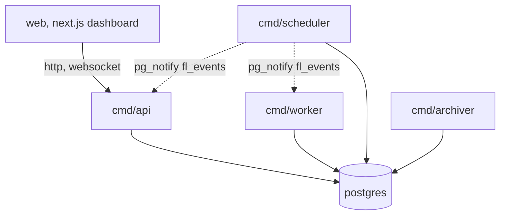
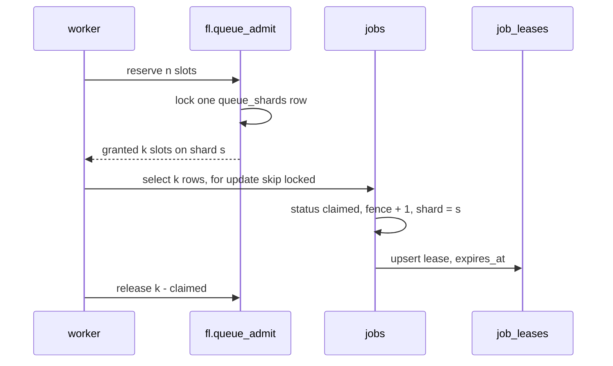
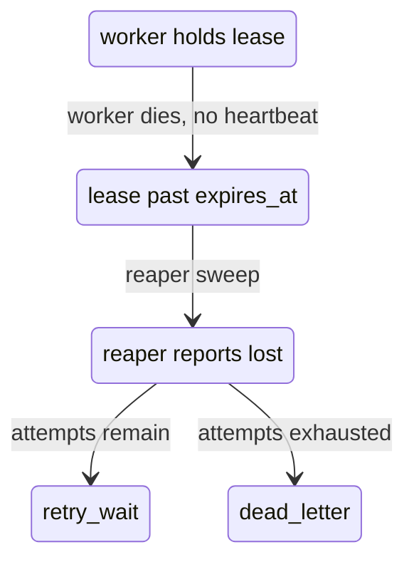

# How it works

Fenceline is a job scheduler whose only coordination point is Postgres. There is no
broker, no Redis, no lock service. Every claim, every retry, every state change is a
row and a transaction, and the correctness argument is about what the database will
and will not allow rather than about what the Go code remembers to do.

That choice is the whole design. It costs throughput — a claim is a round trip and a
commit, not an in-memory pop — and it buys a system where a process can be killed at
any instruction and the recovery is already written down.

## The processes



Five binaries, each taking `DATABASE_URL` and nothing else that matters. They do not
talk to each other. The dotted lines are one `pg_notify` channel, `fl_events`, which
the notifier fires when the event tail moves; the API relays it to open streams and
workers treat it as a hint to poll early. It is a latency optimisation and never a
correctness requirement — with the notifier off, enqueue to start goes from 17 ms to
about seven seconds, and nothing else changes.

| process | what it does |
|---|---|
| `cmd/api` | http, sessions, authorization, the event stream |
| `cmd/worker` | claims jobs, runs handlers, reports outcomes |
| `cmd/scheduler` | promoter, cron, reaper, breaker, notifier, partitions, rollup, failure summaries |
| `cmd/archiver` | moves finished work to cold tables, prunes idempotency keys |
| `cmd/migrate` | applies migrations under an advisory lock, safe to run concurrently |

Every one of them can be run more than once. Nothing in the system assumes a
singleton, which is why the scheduler's sweeps take advisory locks or use unique
indexes rather than assuming they are alone.

## Two counters, and why

A job carries two independent counters and confusing them is the classic bug in this
kind of system.

`attempt_count` is about the work: how many times has a handler been given this job.
It governs backoff and it decides when a job is exhausted.

`fence` is about ownership: it increments on every claim, every retry, and every
snooze. A worker is handed the fence it claimed under, and every write it later makes
carries that fence in the `where` clause. If the row has moved on, the update matches
nothing.

```sql
update jobs set status = 'running'
 where id = $1 and fence = $2 and status = 'claimed'
```

Zero rows affected is not an error to retry. It is the answer: someone else owns this
job now, stop. `fence >= attempt_count` is a check constraint, so the two can never be
silently swapped.

## Claiming



Admission and claiming are separate transactions on purpose. Admission is the only
part that must serialise — it is a counter comparison — so it is kept as short as
possible and committed on its own. The claim then runs with `for update skip locked`,
which never blocks: two workers reaching for the same rows take disjoint sets rather
than queueing.

The consequence is that a worker can be granted five slots and find only three jobs.
It gives the difference back. If the process dies between the two, the counter is
left too high and the queue admits fewer jobs than it could until
`fl.reconcile_in_flight()` repairs it. The drift is always in the safe direction, and
that is deliberate: a counter that drifts low would admit past the cap.

## Losing a worker

Nothing asks a worker whether it is alive. A lease has an `expires_at`, and the reaper
looks for leases that are past it.



The reaper does not need to know why the worker stopped. A crash, a network
partition, and a process paused long enough by the operating system are the same
event, and they get the same handling. When the fenced worker comes back and tries to
report, its fence is stale and its write matches nothing.

That last part is what makes the design work at all. A lease expiring is a guess, and
the guess is sometimes wrong — the worker was alive, just slow. Fencing means a wrong
guess costs a duplicate execution but never a duplicate completion.

## The outbox

State changes and their events are written in the same transaction. `fl.emit` takes a
per-project advisory lock before inserting, so events for one project are totally
ordered by id, and the notifier only has to tell listeners that the tail moved.

The lock is per project rather than global because a global one serialised every write
in the system. Per project, two projects never wait on each other, and within a
project the ordering that consumers actually care about still holds.

## The order locks are taken in

Every transaction that touches more than one of these takes them in this order:

```
1. jobs
2. job_executions
3. job_leases
4. queue_stats_minute
5. queues
6. queue_shards
7. outbox
```

This is not a style preference. An earlier version had `fl.report_failure` emit its
event before the caller released the queue slot, while the success path released
first. Measured under load, that produced 391 deadlocks in 20 trials, and worse: two
completions out of 2400 had their already-successful handlers reported as lost and
re-run. The invariant checker passed on that state, because nothing was structurally
wrong — the ledger simply said something false.

`queues` sits ahead of `queue_shards` because the only path that needs both is
admission with an open circuit breaker, and it takes them in that order.

## Time

Every timestamp in the system comes from `fl.now()`, not from `now()` and not from Go.
In production it is `clock_timestamp()`. Under test, `set fl.testing = 'on'` and
`set fl.now = '...'` move it, so a test can put a job's backoff three hours in the
past without sleeping. `set fl.jitter = 'off'` makes backoff deterministic.

This is why the test suite finishes in minutes rather than hours, and why the retry,
cron, and lease-expiry paths are tested against real elapsed-time logic instead of
against mocks.

## What runs on a timer

The scheduler is a set of independent sweeps, each on its own interval with jitter so
several schedulers do not synchronise.

| sweep | interval | what it does |
|---|---|---|
| promote | 1s | moves due `scheduled` and `retry_wait` jobs to `queued` |
| cron | 1s | materialises schedule ticks, one job per tick by unique index |
| reap | 5s | finds expired leases and reports them lost |
| breaker | 5s | trips and reopens circuit breakers from recent outcomes |
| age | 30s | raises the priority of jobs that have waited too long |
| notify | 20ms | tells listeners the event tail moved |
| rollup | 1m | fills in duration percentiles for closed minutes |
| sweep | 1m | closes execution rows orphaned by paths the reaper does not scan |
| partition | 1h | cuts partitions ahead and drops expired ones |
| summary | 5m | writes failure summaries for queues whose failures changed |

None of them is required for correctness on a short horizon. If the scheduler is down,
jobs stop being promoted and leases stop being reaped, but nothing is lost and nothing
is double-run. It catches up when it returns.

## Where to look next

`SCHEMA.md` is the data model and why it is shaped that way. `DECISIONS.md` is the
trade-offs, including the ones that were measured and reversed. `API.md` is the
endpoint reference. `DIAGRAMS.md` is generated from a live database by `make diagram`.
