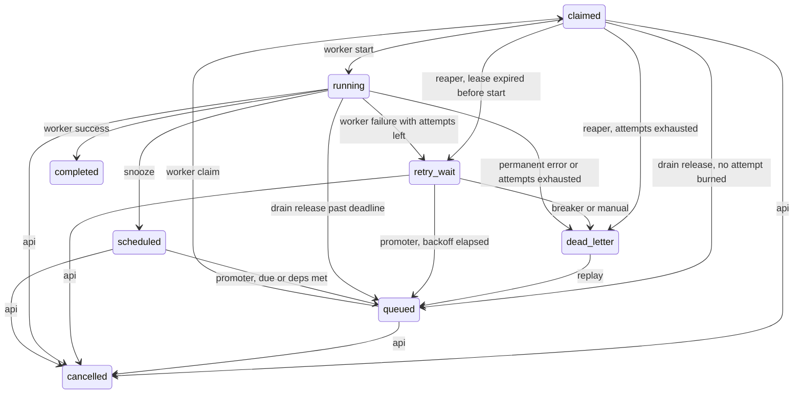
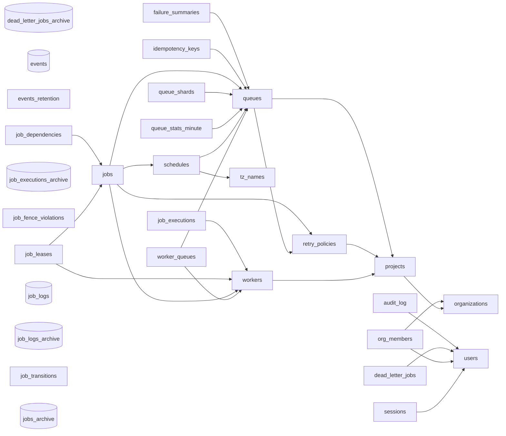

# Diagrams

Generated from a migrated database by `make diagram`. Everything here is read
out of the live catalog, so it cannot drift from the schema it describes.

## The job lifecycle

Every edge is a row in `job_transitions`. A trigger rejects any move not listed
here, so this is the whole state machine and not a summary of it.

## Entities

Key columns only. The label on each line is what happens to the child when the
parent is deleted.

```mermaid
erDiagram
    users ||--o{ audit_log : "actor_id, set null"
    users ||--o{ dead_letter_jobs : "replayed_by, set null"
    queues ||--|{ failure_summaries : "queue_id, cascade"
    queues ||--|{ idempotency_keys : "queue_id, cascade"
    jobs ||--|{ job_dependencies : "child_id, cascade"
    jobs ||--|{ job_dependencies : "parent_id, cascade"
    workers ||--|{ job_executions : "worker_id, restrict"
    jobs ||--|{ job_leases : "job_id, cascade"
    workers ||--|{ job_leases : "worker_id, restrict"
    queues ||--|{ jobs : "project_id, queue_id, cascade"
    retry_policies ||--|{ jobs : "retry_policy_id, restrict"
    schedules ||--o{ jobs : "schedule_id, set null"
    workers ||--o{ jobs : "worker_id, restrict"
    organizations ||--|{ org_members : "org_id, cascade"
    users ||--|{ org_members : "user_id, cascade"
    organizations ||--|{ projects : "org_id, cascade"
    queues ||--|{ queue_shards : "queue_id, cascade"
    queues ||--|{ queue_stats_minute : "queue_id, cascade"
    projects ||--|{ queues : "project_id, cascade"
    retry_policies ||--|{ queues : "retry_policy_id, restrict"
    projects ||--|{ retry_policies : "project_id, cascade"
    queues ||--|{ schedules : "queue_id, cascade"
    tz_names ||--|{ schedules : "timezone, restrict"
    users ||--|{ sessions : "user_id, cascade"
    queues ||--|{ worker_queues : "queue_id, cascade"
    workers ||--|{ worker_queues : "worker_id, cascade"
    projects ||--|{ workers : "project_id, cascade"
    audit_log {
        int8 id PK
        uuid actor_id FK
    }
    dead_letter_jobs {
        uuid job_id PK
        uuid replayed_by FK
    }
    dead_letter_jobs_archive {
        uuid job_id PK
        timestamptz dead_at PK
    }
    events {
        int8 id PK
        timestamptz created_at PK
    }
    events_retention {
        bool only_row PK
    }
    failure_summaries {
        uuid queue_id PK, FK
    }
    idempotency_keys {
        uuid queue_id PK, FK
        text key PK
    }
    job_dependencies {
        uuid parent_id PK, FK
        uuid child_id PK, FK
    }
    job_executions {
        uuid id PK
        uuid worker_id FK
    }
    job_executions_archive {
        uuid id PK
        timestamptz finished_at PK
    }
    job_fence_violations {
        int8 id PK
    }
    job_leases {
        uuid job_id PK, FK
        uuid worker_id FK
    }
    job_logs {
        int8 id PK
        timestamptz ts PK
    }
    job_logs_archive {
        int8 id PK
        timestamptz ts PK
    }
    job_transitions {
        job_status from_status PK
        job_status to_status PK
    }
    jobs {
        uuid id PK
        uuid project_id FK
        uuid queue_id FK
        uuid schedule_id FK
        uuid worker_id FK
        uuid retry_policy_id FK
    }
    jobs_archive {
        uuid id PK
        timestamptz terminal_at PK
    }
    org_members {
        uuid org_id PK, FK
        uuid user_id PK, FK
    }
    organizations {
        uuid id PK
    }
    projects {
        uuid id PK
        uuid org_id FK
    }
    queue_shards {
        uuid queue_id PK, FK
        int2 shard PK
    }
    queue_stats_minute {
        uuid queue_id PK, FK
        timestamptz minute PK
    }
    queues {
        uuid id PK
        uuid project_id FK
        uuid retry_policy_id FK
    }
    retry_policies {
        uuid id PK
        uuid project_id FK
    }
    schedules {
        uuid id PK
        uuid queue_id FK
        text timezone FK
    }
    sessions {
        uuid id PK
        uuid user_id FK
    }
    tz_names {
        text name PK
    }
    users {
        uuid id PK
    }
    worker_queues {
        uuid worker_id PK, FK
        uuid queue_id PK, FK
    }
    workers {
        uuid id PK
        uuid project_id FK
    }
```

## Every table

Cylinders are partitioned by day.

